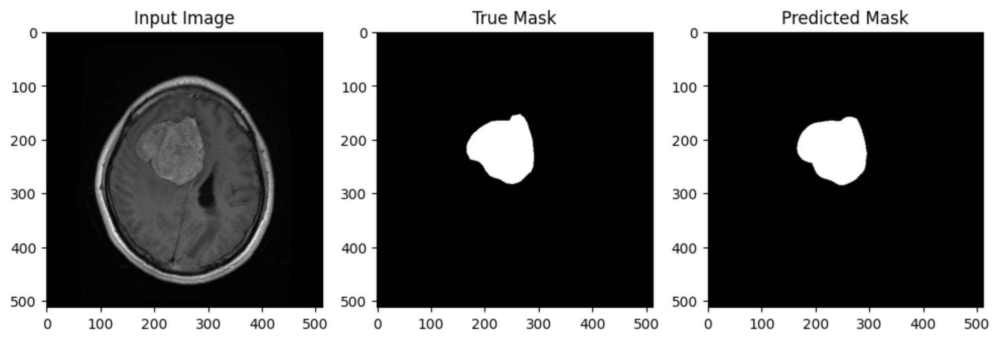

# Brain Segmentation with Enhanced U-Net

## Project Overview

This project presents an enhanced U-Net model for brain tumor segmentation in MRI images. The model integrates advanced techniques like attention mechanisms and custom loss functions to improve the accuracy and reliability of automated brain tumor segmentation. Extensive experimentation demonstrates the model's superior performance, achieving a Dice coefficient of 0.87 and a Mean Intersection over Union (MeanIoU) of 0.97.

## Technology Stack

- **Programming Language**: Python
- **Libraries**: TensorFlow, NumPy, Pandas, Matplotlib
- **Platform**: Google Colab for GPU acceleration

## Getting Started

### Set Up the Environment

1. Open the project notebook in Google Colab:
   [Open Notebook](https://colab.research.google.com/drive/your-colab-notebook-link)
2. Mount your Google Drive to access datasets and save models:
   ```python
   from google.colab import drive
   drive.mount('/content/drive')


## Usage

### Download and Prepare the Dataset

Download the brain tumor segmentation dataset using the Kaggle API by following these steps in Google Colab:

```bash
!pip install kaggle

from google.colab import files
files.upload()  # Upload your kaggle.json file

!mkdir -p ~/.kaggle
!cp kaggle.json ~/.kaggle/
!chmod 600 ~/.kaggle/kaggle.json

!kaggle datasets download -d nikhilroxtomar/brain-tumor-segmentation
!unzip brain-tumor-segmentation.zip -d brain_tumor_segmentation
```
### Steps Explained:
- **Install Kaggle API**: First, install the Kaggle API to access datasets.
- **Upload kaggle.json**: Upload your `kaggle.json` file to authenticate your API requests.
- **Setup Kaggle Directory**: Create a directory for the Kaggle configuration file and ensure correct permissions.
- **Download Dataset**: Use the Kaggle API to download the dataset directly into your Colab environment.
- **Unzip Dataset**: Extract the dataset into a specified directory for use in your project.

## Running the Notebook

To train and evaluate the model, follow these steps:

1. **Open the Notebook**: Open the provided Google Colab notebook link.

2. **Execute Cells**: Run the cells sequentially in the notebook. The notebook is structured to guide you through the data loading, model training, evaluation, and visualization processes.

3. **Monitor Training**: Observe the training progress and outputs, including loss and accuracy metrics, as the model processes the brain tumor segmentation dataset.

By following these steps, you will successfully train and evaluate the U-Net model for brain segmentation within the Google Colab environment.

## Model Architecture

The enhanced U-Net model incorporates several key features:

- **Encoder (Contracting Path)**: Captures contextual information using convolutional layers and downsampling.
- **Bottleneck**: Captures abstract features with high-dimensional representations.
- **Decoder (Expansive Path)**: Reconstructs spatial dimensions through upsampling and concatenation with encoder features.
- **Attention Mechanisms**: Focuses on relevant features to enhance segmentation precision.
- **Custom Loss Function**: Combines weighted binary cross-entropy, Dice coefficient loss, and focal loss.

## Results

### Training and Validation Performance

- **Dice Coefficient**: 0.87
- **MeanIoU**: 0.97
- **Precision**: 0.548
- **Recall**: 0.667
- **AUC (model.evaluate)**: 0.492

## Test Performance

The model was evaluated on a test dataset, achieving high accuracy and robust performance metrics:

| Metric             | Value     |
|--------------------|-----------|
| Loss               | 1.014     |
| Accuracy           | 0.995     |
| AUC                | 0.492     |
| Dice Coefficient   | 0.874     |
| IoU Metric         | 0.815     |
| MeanIoU            | 0.969     |
| Precision          | 0.548     |
| Recall             | 0.667     |

### Confusion Matrix

|                    | Predicted Positive | Predicted Negative |
|--------------------|--------------------|--------------------|
| **Actual Positive**| 117,135,322        | 246,769            |
| **Actual Negative**| 447,401            | 1,708,172          |

### ROC Curve Analysis

The ROC curve demonstrates the model's ability to distinguish between tumor and non-tumor regions, achieving an AUC of 0.90.   

## Sample Predictions

Visualizations of sample predictions compared to the ground truth masks highlight the model’s capability to accurately segment brain regions:

 <!-- Replace with actual path -->


## Paper

The project and its findings are described in detail in the accompanying paper. You can view the paper [here](Brain_Segmentation_U_net.pdf). <!-- Replace with actual path -->

## Conclusion

This study demonstrates the successful implementation of an enhanced U-Net model for brain segmentation in MRI images, achieving high precision and recall. The model's robustness and adaptability promise significant clinical utility, potentially facilitating earlier and more accurate diagnoses of brain tumors.

## Author

**Arnold Cobo**

## Feedback

Enjoy using this project! If you have any comments, constructive criticism, or bug reports, please feel free to [open an issue]() on this repository. Your feedback is greatly appreciated.

## Contact

For direct communication, you can reach me at [cobo.arnold@gmail.com](mailto:cobo.arnold@gmail.com).


